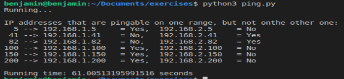

# Ping IP Address

My solution for the programming challenge.

## Requirements

Ping the IP address ranges 192.168.1.0/24 and 192.168.2.0/24 and report all IP addresses that are pingable on one range, but not on the other. For example, if we find that 192.168.1.34 is pingable, but 192.168.2.34 is not pingable, then that's a case we want to know about. Similarly if 192.168.2.34 is pingable, but 192.168.1.34 is not pingable, we also need to know about that.

Additional important requirements:
- You must use python3.6 or higher.
- Your code needs to run quickly, so some kind of multi-threading, multi-tasking, whatever you want to use, is needed.</br>
Implemented using multiprocessing package. In my machine it is running in less than a minute average. Considering all ip addresses are timed-out.
- You will need to retry IP addresses that fail on their first ping. The number of retry attempts is up to you.</br>
Attempting twice.
- Your code MUST have no PEP8 issues and MUST include comments and docstrings where appropriate.
- Please include mock-tests, unit-tests, any kind of tests that you write to help prove that your code behaves as expected.</br>
As those addresses are not reachable in my computer, first I tested the program for known addresses like google.com or any website. Then, to test the selection of the ip addresses, I introduced some predefined data to see if the outputs of the functions are correct.
- As we are an Ubuntu/Linux shop, implementing it there (or maybe macOS) would be preferred but not absolutely required.</br>
Developed on Windows 10, but also tested on Ubuntu 18.04 virtual machine.
-BONUS: Allow specific IP addresses to be skipped based on their last octet, so for example we could exclude 192.168.1.56 and 192.168.2.56 by specifying '56' to some function in your code,

## Instructions

1. Clone the project repository:</br>
```
git clone https://github.com/blelevier/ping_ip_address.git
```

2. Run some tests to check your connection and review some functions of the script.
```
python3 test_ping.py
```


3. Change directory and run the file:</br>
```
python3 ping.py
```
You can skip specific IP addresses with `python3 ping.py arg1 arg2 arg3` by specifying their last octet instead of arg1, arg2, ..., argn. For example this line will skip pairs [192.168.1.58, 192.168.2.58], [192.168.1.123, 192.168.2.123] and [192.168.1.237, 192.168.2.237].
```
python3 ping.py 58 123 237
```

## Results

</br>


## Future Work 

- Analize complexity and explore other approaches to multi-threading/tasking to make it faster.
- Explore maximum number of available cores to increase the number of threads.
- Get more familiar with wireshark, tcpdump.

